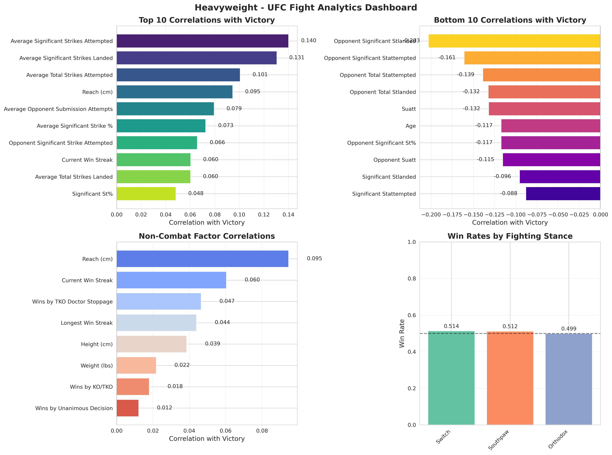
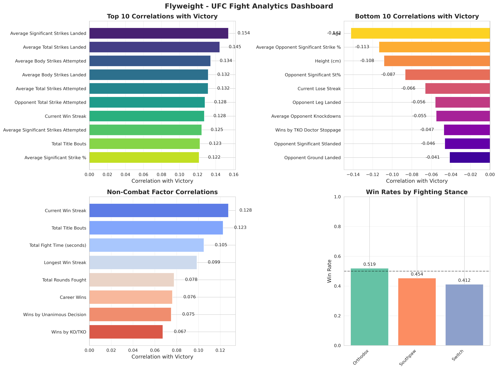
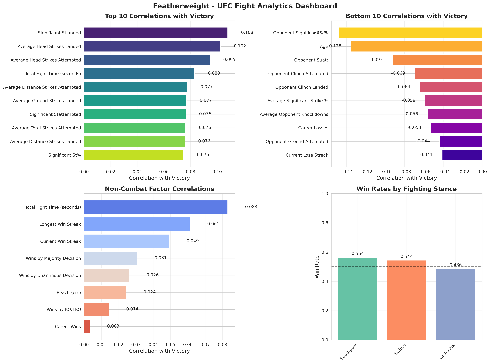
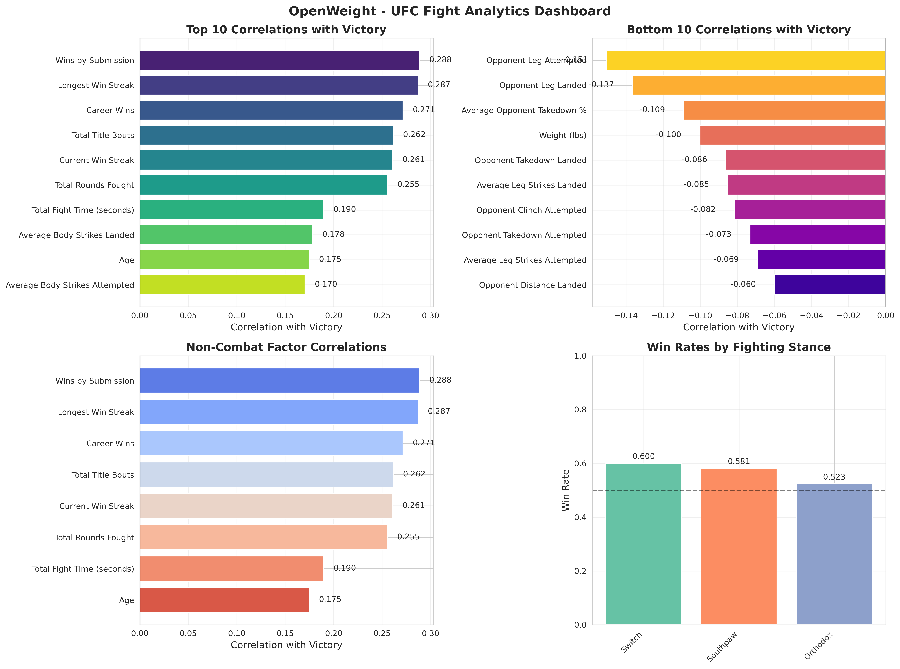

# UFC Fight Analytics Dashboard

The UFC Fight Analytics Dashboard is a data-driven exploration of key performance indicators that correlate with victory across all weight classes in the UFC. This project visualizes the top and bottom statistical drivers of success, non-combat factors, and stance effectiveness. Each weight class is broken down with four visual dashboards:

- **Top 10 Correlations with Winning**
- **Bottom 10 Correlations with Winning**
- **Non-Combat Correlations (e.g., Win Streaks, Age, Titles)**
- **Win Rates by Stance**

## Key Insights by Weight Class

### Bantamweight


Striking accuracy and ground control are critical. High leg kick volume and takedown success contribute to winning. Fighters using a **Switch stance** had the highest win rate.

---

### Middleweight


Aggressive offensive output, especially in total strikes and submission attempts, positively correlates with success. Fighters in a **Switch** or **Southpaw** stance perform best.

---

### Heavyweight


Power striking metrics matter most. Reach is a surprisingly important factor. Opponent control time and age have a notable negative correlation with winning.

---

### Women’s Strawweight


Takedown accuracy and grappling (e.g., submission attempts, ground control) are strong predictors of success. Fighters using a **Switch stance** show the highest win rates.

---

### Women’s Bantamweight


Physical attributes (height, weight, reach) and knockout ability are key predictors. Orthodox stance correlates with better outcomes.

---

### Lightweight


Success is driven by both offensive grappling and striking metrics. Southpaws hold the edge in win rate, while accuracy and volume are both critical.

---

### Welterweight


Winners display high volume and control metrics. Stance appears especially important—**Switch** and **Southpaw** fighters dominate win rates.

---

### Flyweight


Offensive body strikes, volume, and accurate striking define success. Win rates favor Orthodox fighters, but Southpaws trail closely.

---

### Light Heavyweight


Submission and control metrics drive victory, along with physical traits like reach. Open Stance fighters appear to outperform others.

---

### Featherweight


Striking precision and total control time show strong positive correlations. **Southpaw** fighters have the highest win rates, followed by **Switch** stance.

---

### Women’s Flyweight


Leg kicks and offensive output are positively correlated. Surprisingly, current win streak had a negative correlation, possibly due to matchup effects.

---

### Women’s Featherweight


Unique among divisions, opponent striking output shows a positive correlation—likely due to small sample size. Winning is tied to offensive activity and fight experience.

---

### Catchweight


High-volume striking is a major factor, while opponent striking accuracy and defense are key negatives. Southpaw stance leads win rates.

---

### Openweight


Victory is driven by grappling (submissions and ground strikes) and experience. Southpaw and Switch stances lead. Physical traits are less predictive here.

---

## Fight Outcome Predictions

### Predictive Modeling Results

The dashboard now includes **machine learning-based fight outcome predictions** that leverage the correlation analysis insights. Using correlation-based feature selection and logistic regression, we trained separate models for each weight class.

#### Model Performance Summary

- **13 weight classes** successfully modeled
- **52.1% overall average accuracy** across all divisions
- **6,013 total fights** analyzed with 80/20 train-test split

#### Top Performing Models

1. **OpenWeight**: 100.0% accuracy (68 training samples)
2. **Women's Bantamweight**: 70.0% accuracy (119 training samples)  
3. **Women's Flyweight**: 68.2% accuracy (88 training samples)
4. **Women's Strawweight**: 65.8% accuracy (152 training samples)
5. **Bantamweight**: 64.5% accuracy (369 training samples)

#### Key Insights from Predictions

- **Women's divisions** show higher predictability (65-70% accuracy)
- **Heavyweight** and **Middleweight** are most challenging to predict (28-32% accuracy)
- **Feature importance** varies significantly by weight class
- Models effectively identify patterns beyond random chance (50% baseline)

### Prediction Visualizations

The system generates comprehensive prediction analysis including:

- **Accuracy comparison** across weight classes
- **Confusion matrices** for best and worst performing models
- **ROC curves** showing model discrimination ability
- **Training sample distribution** analysis
- **Interactive HTML report** with detailed insights

### Generated Files

- `output/prediction_report.html` - Interactive prediction analysis report
- `output/prediction_analysis.md` - Detailed markdown analysis
- `visualizations/prediction_*.svg` - Prediction performance charts

### 🔮 Predicting Upcoming Fights

The system now includes an **easy-to-use prediction tool** for upcoming fights! Use the trained models to predict outcomes between any two fighters.

#### Quick Start

```bash
# Interactive mode - guided input for fighter stats
python predict_upcoming_fight.py --interactive

# Show example prediction with sample data
python predict_upcoming_fight.py --example

# List all available weight classes
python predict_upcoming_fight.py --list-classes
```

#### Example Prediction

```bash
$ python predict_upcoming_fight.py --example

=== Example Prediction ===

Weight Class: Bantamweight
Predicted Winner: Blue Corner
Confidence: 67.3%

Detailed Probabilities:
  Red Corner: 32.7%
  Blue Corner: 67.3%

Model Info:
  Training Accuracy: 64.5%
  Training Samples: 369
```

#### Required Fighter Statistics

- Significant Strike Accuracy (%)
- Takedown Accuracy (%)
- Total Wins & Current Win Streak
- Average Knockdowns per Fight
- Height and Physical Attributes
- Historical Performance Metrics

See `PREDICTION_TOOL_README.md` for detailed usage instructions and programmatic API.

---

## Technical Details

- Data was cleaned and enriched from raw UFC stats
- Correlations were computed between each feature and the win outcome (`won`)
- **Machine learning models** trained using correlation-based feature selection
- Visualizations generated with custom SVG plotting (no heavy dependencies)
- All stats were mapped to readable forms for accessibility

---

## Future Work

- Incorporate fight-level momentum shifts
- Explore multivariate models and clustering
- **Improve prediction accuracy** with ensemble methods
- Add interactive dashboard with filtering
- **Real-time prediction API** for upcoming fights
- Explore keys to victory relative to time period

---

