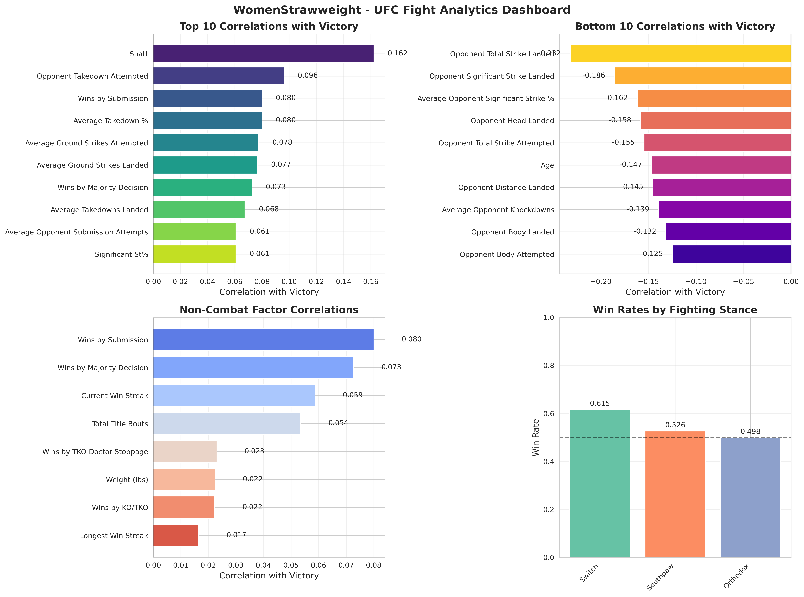
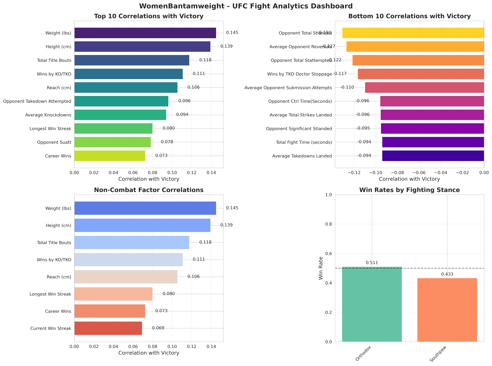
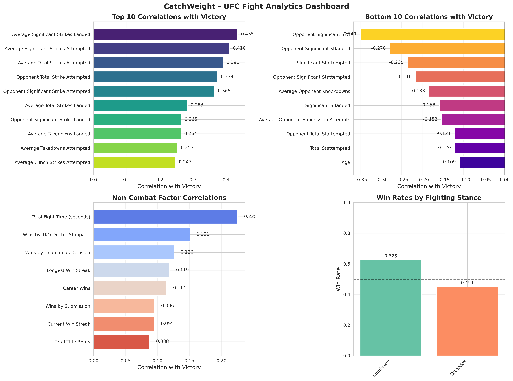

# UFC Fight Analytics Dashboard

The UFC Fight Analytics Dashboard is a data-driven exploration of key performance indicators that correlate with victory across all weight classes in the UFC. This project visualizes the top and bottom statistical drivers of success, non-combat factors, and stance effectiveness. Each weight class is broken down with four visual dashboards:

- **Top 10 Correlations with Winning**
- **Bottom 10 Correlations with Winning**
- **Non-Combat Correlations (e.g., Win Streaks, Age, Titles)**
- **Win Rates by Stance**

## Key Insights by Weight Class

### Bantamweight

Striking accuracy and ground control are critical. High leg kick volume and takedown success contribute to winning. Fighters using a **Switch stance** had the highest win rate.

---

### Middleweight

Aggressive offensive output, especially in total strikes and submission attempts, positively correlates with success. Fighters in a **Switch** or **Southpaw** stance perform best.

---

### Heavyweight

Power striking metrics matter most. Reach is a surprisingly important factor. Opponent control time and age have a notable negative correlation with winning.

---

### Women’s Strawweight

Takedown accuracy and grappling (e.g., submission attempts, ground control) are strong predictors of success. Fighters using a **Switch stance** show the highest win rates.

---

### Women’s Bantamweight

Physical attributes (height, weight, reach) and knockout ability are key predictors. Orthodox stance correlates with better outcomes.

---

### Lightweight

Success is driven by both offensive grappling and striking metrics. Southpaws hold the edge in win rate, while accuracy and volume are both critical.

---

### Welterweight

Winners display high volume and control metrics. Stance appears especially important—**Switch** and **Southpaw** fighters dominate win rates.

---

### Flyweight

Offensive body strikes, volume, and accurate striking define success. Win rates favor Orthodox fighters, but Southpaws trail closely.

---

### Light Heavyweight

Submission and control metrics drive victory, along with physical traits like reach. Open Stance fighters appear to outperform others.

---

### Featherweight

Striking precision and total control time show strong positive correlations. **Southpaw** fighters have the highest win rates, followed by **Switch** stance.

---

### Women’s Flyweight

Leg kicks and offensive output are positively correlated. Surprisingly, current win streak had a negative correlation, possibly due to matchup effects.

---

### Women’s Featherweight

Unique among divisions, opponent striking output shows a positive correlation—likely due to small sample size. Winning is tied to offensive activity and fight experience.

---

### Catchweight

High-volume striking is a major factor, while opponent striking accuracy and defense are key negatives. Southpaw stance leads win rates.

---

### Openweight

Victory is driven by grappling (submissions and ground strikes) and experience. Southpaw and Switch stances lead. Physical traits are less predictive here.

---

## Technical Details

- Data was cleaned and enriched from raw UFC stats
- Correlations were computed between each feature and the win outcome (`won`)
- Visualizations generated with Matplotlib and Seaborn
- All stats were mapped to readable forms for accessibility

---

## Future Work

- Incorporate fight-level momentum shifts
- Explore multivariate models and clustering
- Add interactive dashboard with filtering
- Explore keys to victory relative to time period

---

